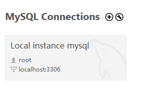
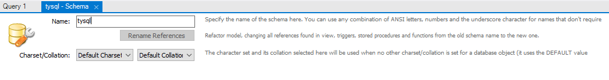
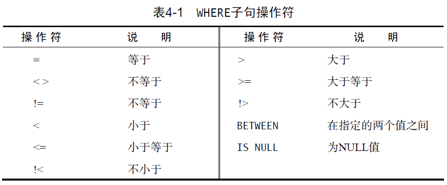

# SQL Notes

记录一下学习SQL必知必会一书的笔记。

[TOC]

## 环境安装

首先配置SQL环境（只在Win10测试过），这里我安装的是MySQL和MySQL WorkBench，[百度云盘](https://pan.baidu.com/s/1ukbLZs-3IMWlAt06Fi2USA)，提取码：cqtf

先安装MySQL，压缩包是已经打包好的，解压后不用安装了，然后是配置步骤：

1. 将“根目录/bin”路径添加到环境变量Path中
2. 使用管理员cmd
3. 输入`mysqld --initialize-insecure --user=mysql`
4. 然后输入`mysqld --install mysql`
5. 然后输入`net start mysql`
6. 然后输入 `mysql -u root -p`, 没有密码回车进入MySQL.

以上是配置MySQL, 然后是安装MySQL Workbench, 运行程序安装即可, 安装好后运行MySQL Workbench, 左下侧应该有一个MySQL Connection, 双击local instance mysql进入. 如果没有connection, 则需要点击+号创建新的connections.



## 数据准备

当前进入的连接服务器只有sys数据库, 首先我们需要新建一个数据库, 点击左上角的第二个+号( Create New Schema button), 命名数据库为tysql, 然后点击右下角的apply, 然后再点击第二个apply即创建成功



在Schemas中双击我们刚刚创建的tysql数据库, 然后在上面的百度云盘中, 有一个data文件夹用来生成数据, 我们把create.txt的内容拷贝到Query1窗口下, 然后点击 Query1窗口的第一个闪电运行程序, 运行完成后, 清空Query1的内容, 再把populate.txt的内容拷贝到Query1窗口下, 点击闪电运行程序, 运行完成后右键数据库tysql, 点击refresh all刷新数据库, Tables就会出现5个tables.

## 检索数据

```mysql
SELECT prod_name FROM products; -- 检索单列
SELECT prod_id, prod_name, prod_price FROM products; -- 检索多个列
SELECT * FROM products; -- 检索所有列
SELECT DISTINCT vend_id FROM products; -- 检索一个列中不同的值
SELECT DISTINCT vend_id, prod_price FROM products; -- 检索两个列中不同的值(以行来区别)
SELECT prod_name FROM products LIMIT 5; -- 检索一列的前5行
SELECT prod_name FROM products LIMIT 5 OFFSET 5; -- 检索一列的第6行到10行, 第一行索引是0, 所以OFFSET 5代表的是第六行
```

- 注释tips: 基于单行有`--`和`#`, 紧接它后面的即为注释, 多行的是使用`/*`和`*/`, 类似C/C++语言.

## 排序检索数据

SQL是由子句构成的, 有些子句是必需的, 有些是可选的, 一个子句通常由一个关键字加上所提供的数据组成。 比如SELECT XX 后面的FROM子句,  这是必需的, 而有些是可选的, 比如对检索出的数据进行排序的ORDER BY 子句.

- 注: 在指定一条ORDER BY 子句时，应该保证它是SELECT 语句中最后一条子句。如果它不是最后的子句，将会出现错误消息。

```mysql
-- 检索单列,并基于选择列排序
SELECT prod_name FROM products ORDER BY prod_name;
-- 检索单列,并基于非选择列排序
SELECT prod_name FROM products ORDER BY prod_price;
-- 检索多列, 基于单个选择列排序
SELECT prod_id, prod_price, prod_name FROM products ORDER BY prod_price;
-- 检索多列, 基于多个选择列排序, 先基于prod_price排序, prod_price中有相同的基于prod_name排序
SELECT prod_id, prod_price, prod_name FROM products ORDER BY prod_price, prod_name;
-- 基于选择列的次序排序, 2,3代表prod_price, prod_name
SELECT prod_id, prod_price, prod_name FROM products ORDER BY 2, 3; 
-- 默认是升序排序,在基于某列排序时,后面加上DESC, 则可以降序排列
SELECT prod_id, prod_price, prod_name FROM products ORDER BY prod_price DESC;
-- 先基于prod_price降序排列,然后基于prod_name升序排列
SELECT prod_id, prod_price, prod_name FROM products ORDER BY prod_price DESC, prod_name;
```

## 过滤数据

过滤数据使用where子句，where后面跟上搜索条件，条件为真会输出。

```mysql
SELECT prod_name, prod_price
FROM products
WHERE prod_price = 3.49;

SELECT prod_name, prod_price
FROM products
WHERE prod_price < 10;

-- 搜索字符串时需要加上单引号，数值则不需要加，此外<>一般可以替换!=，但有的系统不行。
SELECT vend_id, prod_name
FROM Products
WHERE vend_id <> 'DLL01'; 

SELECT prod_name, prod_price
FROM Products
WHERE prod_price BETWEEN 5 AND 10;
```

除了上面的示例，where子句还支持下面的操作符。



## 高级数据过滤

上面一节中where的搜索条件时单个，这一节是组合多个操作符。

```mysql
-- 与运算
SELECT prod_id, prod_price, prod_name
FROM products
WHERE vend_id = 'DLL01' AND prod_price <= 4;

-- 或运算
SELECT prod_name, prod_price
FROM Products
WHERE vend_id = 'DLL01' OR vend_id = 'BRS01';

-- 注：与运算的优先级要高于或运算，会导致意外输出
SELECT prod_name, prod_price
FROM Products
WHERE vend_id = 'DLL01' OR vend_id = 'BRS01'
AND prod_price >= 10;

-- 若需先进行或运算，需要将或运算括起来，然后进行与运算
SELECT prod_name, prod_price
FROM Products
WHERE (vend_id = 'DLL01' OR vend_id = 'BRS01')
AND prod_price >= 10;

-- 等效于示例2的或运算，不过IN更好，好在更直观，更快，求值顺序不用担心以及可以再包括select语句
SELECT prod_name, prod_price
FROM Products
WHERE vend_id IN ( 'DLL01', 'BRS01' )
ORDER BY prod_name;

-- 非运算，更复杂的子句会比较有用，与IN搭配
SELECT prod_name
FROM Products
WHERE NOT vend_id = 'DLL01'
ORDER BY prod_name;
```

## 通配符进行过滤

对于文本，通常使用通配符来进行过滤，SQL语句中则使用LIKE子句进行通配符过滤。

```mysql
-- 字符匹配不同系统对于字符大小写是否相同不太一样，在MySQL workbench上是相同的

-- %号代表表示任何字符出现任意次数, Microsoft Access使用*而不是%
-- 通配符%看起来像是可以匹配任何东西，但有个例外，这就是NULL。
SELECT prod_id, prod_name
FROM Products
WHERE prod_name LIKE 'Fish%';

SELECT prod_id, prod_name
FROM Products
WHERE prod_name LIKE '%bean bag%';

-- 注：此匹配必须是F开头，y结尾，有时会存在y后面有空格，此时是不匹配的
SELECT prod_name
FROM Products
WHERE prod_name LIKE 'F%y';

-- _号代表只匹配单个字符，Microsoft Access使用？而不是_
SELECT prod_id, prod_name
FROM Products
WHERE prod_name LIKE '__ inch teddy bear';

-- MySQL不支持中括号的集合操作，下面没有输出，只有微软的Access 和SQL Server 支持集合。
SELECT cust_contact
FROM Customers
WHERE cust_contact LIKE '[JM]%'
ORDER BY cust_contact;
```

- 通配符搜索比较耗时，如果用其他操作符搜索可以达到目的，应用其他操作符。

- 通配符置于开始处，搜索起来是最慢的。
- 仔细注意通配符的位置。

## 创建计算字段

数据库中存储的数据一般不是我们想要的，要从数据库中检索出转换、计算或格式化过的数据，而不是检索
出数据，然后再在客户端应用程序中重新格式化（增加客户端的负担）。

```mysql
-- 要生成一个供应商报表，需要在格式化的名称中列出供应商的位置，使用Concat函数组合数据
SELECT Concat(vend_name, ' (', vend_country, ')')
FROM Vendors
ORDER BY vend_name;

-- 上面的列没有名字，客户端无法引用，可以通过AS关键字赋予别名
SELECT Concat(vend_name, ' (', vend_country, ')')
	   AS vend_title
FROM Vendors
ORDER BY vend_name;

-- 对检索的数据进行算术运算（加减乘除皆可，这里是乘），得到总价格，并使用AS关键词得到别名，方便引用
SELECT prod_id,
quantity,
item_price,
quantity*item_price AS expanded_price
FROM OrderItems
WHERE order_num = 20008;
```

