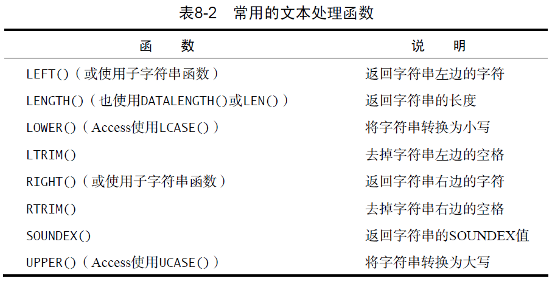
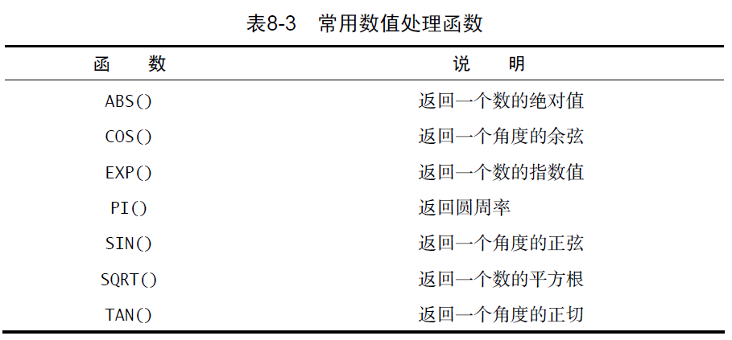
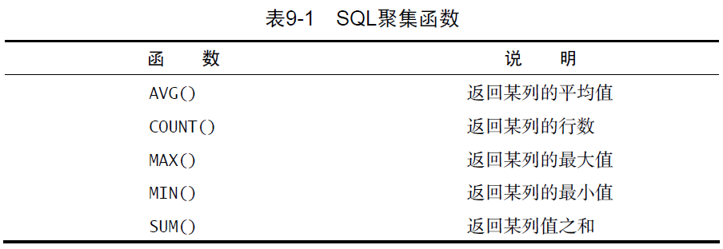
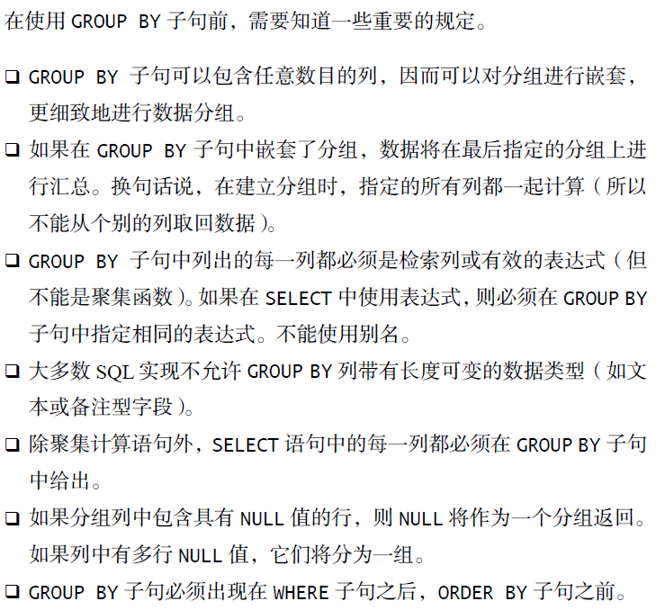
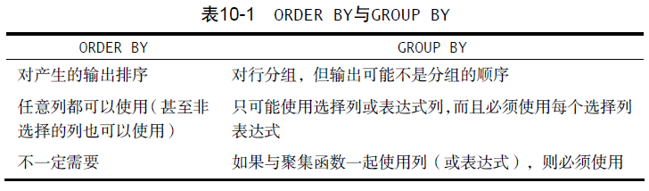
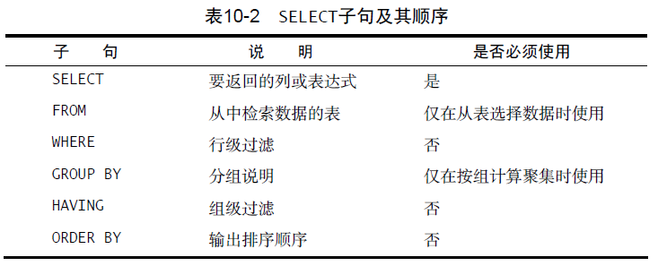
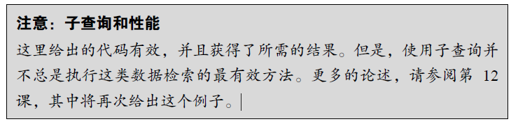
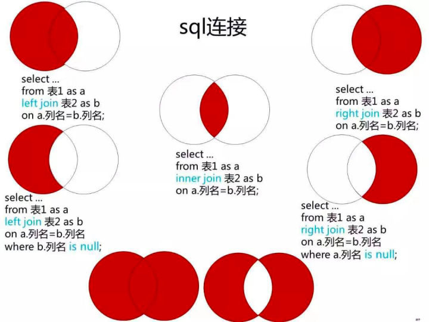

# SQL Notes

记录一下学习SQL必知必会一书的笔记。

[TOC]

## 环境安装

首先配置SQL环境（只在Win10测试过），这里我安装的是MySQL和MySQL WorkBench，[百度云盘](https://pan.baidu.com/s/1ukbLZs-3IMWlAt06Fi2USA)，提取码：cqtf

先安装MySQL，压缩包是已经打包好的，解压后不用安装了，然后是配置步骤：

1. 将“根目录/bin”路径添加到环境变量Path中
2. 使用管理员cmd
3. 输入`mysqld --initialize-insecure --user=mysql`
4. 然后输入`mysqld --install mysql`
5. 然后输入`net start mysql`
6. 然后输入 `mysql -u root -p`, 没有密码回车进入MySQL.

以上是配置MySQL, 然后是安装MySQL Workbench, 运行程序安装即可, 安装好后运行MySQL Workbench, 左下侧应该有一个MySQL Connection, 双击local instance mysql进入. 如果没有connection, 则需要点击+号创建新的connections.


## 数据准备

当前进入的连接服务器只有sys数据库, 首先我们需要新建一个数据库, 点击左上角的第二个+号( Create New Schema button), 命名数据库为tysql, 然后点击右下角的apply, 然后再点击第二个apply即创建成功


在Schemas中双击我们刚刚创建的tysql数据库, 然后在上面的百度云盘中, 有一个data文件夹用来生成数据, 我们把create.txt的内容拷贝到Query1窗口下, 然后点击 Query1窗口的第一个闪电运行程序, 运行完成后, 清空Query1的内容, 再把populate.txt的内容拷贝到Query1窗口下, 点击闪电运行程序, 运行完成后右键数据库tysql, 点击refresh all刷新数据库, Tables就会出现5个tables.

## 检索数据

```mysql
SELECT prod_name FROM products; -- 检索单列
SELECT prod_id, prod_name, prod_price FROM products; -- 检索多个列
SELECT * FROM products; -- 检索所有列
SELECT DISTINCT vend_id FROM products; -- 检索一个列中不同的值
SELECT DISTINCT vend_id, prod_price FROM products; -- 检索两个列中不同的值(以行来区别)
SELECT prod_name FROM products LIMIT 5; -- 检索一列的前5行
SELECT prod_name FROM products LIMIT 5 OFFSET 5; -- 检索一列的第6行到10行, 第一行索引是0, 所以OFFSET 5代表的是第六行
```

- 注释tips: 基于单行有`--`和`#`, 紧接它后面的即为注释, 多行的是使用`/*`和`*/`, 类似C/C++语言.

## 排序检索数据

SQL是由子句构成的, 有些子句是必需的, 有些是可选的, 一个子句通常由一个关键字加上所提供的数据组成。 比如SELECT XX 后面的FROM子句,  这是必需的, 而有些是可选的, 比如对检索出的数据进行排序的ORDER BY 子句.

- 注: 在指定一条ORDER BY 子句时，应该保证它是SELECT 语句中最后一条子句。如果它不是最后的子句，将会出现错误消息。

```mysql
-- 检索单列,并基于选择列排序
SELECT prod_name FROM products ORDER BY prod_name;
-- 检索单列,并基于非选择列排序
SELECT prod_name FROM products ORDER BY prod_price;
-- 检索多列, 基于单个选择列排序
SELECT prod_id, prod_price, prod_name FROM products ORDER BY prod_price;
-- 检索多列, 基于多个选择列排序, 先基于prod_price排序, prod_price中有相同的基于prod_name排序
SELECT prod_id, prod_price, prod_name FROM products ORDER BY prod_price, prod_name;
-- 基于选择列的次序排序, 2,3代表prod_price, prod_name
SELECT prod_id, prod_price, prod_name FROM products ORDER BY 2, 3; 
-- 默认是升序排序,在基于某列排序时,后面加上DESC, 则可以降序排列
SELECT prod_id, prod_price, prod_name FROM products ORDER BY prod_price DESC;
-- 先基于prod_price降序排列,然后基于prod_name升序排列
SELECT prod_id, prod_price, prod_name FROM products ORDER BY prod_price DESC, prod_name;
```

## 过滤数据

过滤数据使用where子句，where后面跟上搜索条件，条件为真会输出。

```mysql
SELECT prod_name, prod_price
FROM products
WHERE prod_price = 3.49;

SELECT prod_name, prod_price
FROM products
WHERE prod_price < 10;

-- 搜索字符串时需要加上单引号，数值则不需要加，此外<>一般可以替换!=，但有的系统不行。
SELECT vend_id, prod_name
FROM Products
WHERE vend_id <> 'DLL01'; 

SELECT prod_name, prod_price
FROM Products
WHERE prod_price BETWEEN 5 AND 10;
```

除了上面的示例，where子句还支持下面的操作符。


## 高级数据过滤

上面一节中where的搜索条件时单个，这一节是组合多个操作符。

```mysql
-- 与运算
SELECT prod_id, prod_price, prod_name
FROM products
WHERE vend_id = 'DLL01' AND prod_price <= 4;

-- 或运算
SELECT prod_name, prod_price
FROM Products
WHERE vend_id = 'DLL01' OR vend_id = 'BRS01';

-- 注：与运算的优先级要高于或运算，会导致意外输出
SELECT prod_name, prod_price
FROM Products
WHERE vend_id = 'DLL01' OR vend_id = 'BRS01'
AND prod_price >= 10;

-- 若需先进行或运算，需要将或运算括起来，然后进行与运算
SELECT prod_name, prod_price
FROM Products
WHERE (vend_id = 'DLL01' OR vend_id = 'BRS01')
AND prod_price >= 10;

-- 等效于示例2的或运算，不过IN更好，好在更直观，更快，求值顺序不用担心以及可以再包括select语句
SELECT prod_name, prod_price
FROM Products
WHERE vend_id IN ( 'DLL01', 'BRS01' )
ORDER BY prod_name;

-- 非运算，更复杂的子句会比较有用，与IN搭配
SELECT prod_name
FROM Products
WHERE NOT vend_id = 'DLL01'
ORDER BY prod_name;
```

## 通配符进行过滤

对于文本，通常使用通配符来进行过滤，SQL语句中则使用LIKE子句进行通配符过滤。

```mysql
-- 字符匹配不同系统对于字符大小写是否相同不太一样，在MySQL workbench上是相同的

-- %号代表表示任何字符出现任意次数, Microsoft Access使用*而不是%
-- 通配符%看起来像是可以匹配任何东西，但有个例外，这就是NULL。
SELECT prod_id, prod_name
FROM Products
WHERE prod_name LIKE 'Fish%';

SELECT prod_id, prod_name
FROM Products
WHERE prod_name LIKE '%bean bag%';

-- 注：此匹配必须是F开头，y结尾，有时会存在y后面有空格，此时是不匹配的
SELECT prod_name
FROM Products
WHERE prod_name LIKE 'F%y';

-- _号代表只匹配单个字符，Microsoft Access使用？而不是_
SELECT prod_id, prod_name
FROM Products
WHERE prod_name LIKE '__ inch teddy bear';

-- MySQL不支持中括号的集合操作，下面没有输出，只有微软的Access 和SQL Server 支持集合。
SELECT cust_contact
FROM Customers
WHERE cust_contact LIKE '[JM]%'
ORDER BY cust_contact;
```

- 通配符搜索比较耗时，如果用其他操作符搜索可以达到目的，应用其他操作符。

- 通配符置于开始处，搜索起来是最慢的。
- 仔细注意通配符的位置。

## 创建计算字段

数据库中存储的数据一般不是我们想要的，要从数据库中检索出转换、计算或格式化过的数据，而不是检索
出数据，然后再在客户端应用程序中重新格式化（增加客户端的负担）。

```mysql
-- 要生成一个供应商报表，需要在格式化的名称中列出供应商的位置，使用Concat函数组合数据
SELECT Concat(vend_name, ' (', vend_country, ')')
FROM Vendors
ORDER BY vend_name;

-- 上面的列没有名字，客户端无法引用，可以通过AS关键字赋予别名
SELECT Concat(vend_name, ' (', vend_country, ')')
	   AS vend_title
FROM Vendors
ORDER BY vend_name;

-- 对检索的数据进行算术运算（加减乘除皆可，这里是乘），得到总价格，并使用AS关键词得到别名，方便引用
SELECT prod_id,
quantity,
item_price,
quantity*item_price AS expanded_price
FROM OrderItems
WHERE order_num = 20008;
```

## 使用数据处理函数

这一节主要介绍使用数据库中的函数处理数据，当由于不同数据库的函数名不同以及有些并没有，所以书中许多函数的例子在mysql中没有，无法运行。

```mysql
-- 对字符串取大写
SELECT vend_name, UPPER(vend_name) AS vend_name_upcase
FROM Vendors
ORDER BY vend_name;

-- SOUNDEX是一个将任何文本串转换为描述其语音表示的字母数字模式的算法。打错了字母发音类似也会查找出来
SELECT cust_name, cust_contact
FROM Customers
WHERE SOUNDEX(cust_contact) = SOUNDEX('Michael Green');

-- 得到当前的年份
SELECT order_num
FROM Orders
WHERE YEAR(order_date) = 2012;
```

以下是一些常用的文本处理函数，MySQL都支持。



以下是一些常用的数值函数。



## 汇总数据

这节是聚集函数进行汇总数据，有以下五个函数：



代码如下：

```mysql
SELECT AVG(prod_price) AS avg_price
FROM Products;

SELECT AVG(prod_price) AS avg_price
FROM Products
WHERE vend_id = 'DLL01';

-- COUNT(*)对表中行的数目进行计数，不管表列中包含的是空值还是非空值。
SELECT COUNT(*) AS num_cust
FROM Customers;

-- 没有*号就忽略空值
SELECT COUNT(cust_email) AS num_cust
FROM Customers;

SELECT MAX(prod_price) AS max_price
FROM Products;

SELECT MIN(prod_price) AS min_price
FROM Products;

SELECT SUM(quantity) AS items_ordered
FROM OrderItems
WHERE order_num = 20005;

SELECT SUM(item_price*quantity) AS total_price
FROM OrderItems
WHERE order_num = 20005;

-- DISTINCT是去除重值
SELECT AVG(DISTINCT prod_price) AS avg_price
FROM Products
WHERE vend_id = 'DLL01';

SELECT COUNT(*) AS num_items,
	   MIN(prod_price) AS price_min,
	   MAX(prod_price) AS price_max,
	   AVG(prod_price) AS price_avg
FROM Products;
```

## 分组数据

这一节是将数据分组，使用GROUP by 和 HAVING 子句。

```mysql
-- 单个列单个类别的统计
SELECT COUNT(*) AS num_prods
FROM Products
WHERE vend_id = 'DLL01';

-- 使用GROUP BY对单个列多个类别进行统计
SELECT vend_id, COUNT(*) AS num_prods
FROM Products
GROUP BY vend_id;

-- GROUP BY分组，HAVING进行组别过滤
SELECT cust_id, COUNT(*) AS orders
FROM Orders
GROUP BY cust_id
HAVING COUNT(*) >= 2;

-- WHERE过滤行，然后GROUP BY分组，最后使用HAVING过滤
SELECT vend_id, COUNT(*) AS num_prods
FROM Products
WHERE prod_price >= 4
GROUP BY vend_id
HAVING COUNT(*) >= 2;

-- GROUP BY分组，最后使用HAVING过滤
SELECT vend_id, COUNT(*) AS num_prods
FROM Products
GROUP BY vend_id
HAVING COUNT(*) >= 2;

-- GROUP BY分组，HAVING过滤，最后ORDER BY排序 
SELECT order_num, COUNT(*) AS items
FROM OrderItems
GROUP BY order_num
HAVING COUNT(*) >= 3
ORDER BY items, order_num;
```

GROUP BY子句的重要规定：



HAVING和WHRER的区别：


ORDER BY和GROUP BY的区别：



SELECT子句顺序：



## 使用子查询

迄今为止所看到的所有SELECT 语句都是简单查询，即从单个数据库表中检索数据的单条语句。SQL 还允许创建子查询（subquery），即嵌套在其他查询中的查询。书中使用的数据库表都是关系表，订单存储在两个表中。每个订单包含订单编号、客户ID、订单日期，在Orders 表中存储为一行。各订单的物品存储在相关的OrderItems 表中。Orders 表不存储顾客信息，只存储顾客ID。顾客的实际信息存储在Customers 表中。

假如需要列出订购物品RGAN01 的所有顾客，应该怎样检索？下面列出具体的步骤。

1. 检索包含物品RGAN01 的所有订单的编号。
2. 检索具有前一步骤列出的订单编号的所有顾客的ID。
3. 检索前一步骤返回的所有顾客ID 的顾客信息。

每一步可以作为一个单独的查询进行。可以把一条SELECT 语句返回的结果用于另一条SELECT 语句的WHERE 子句。也可以使用子查询来把3个查询组合成一条语句。

```mysql
-- 分以下三个查询子句
SELECT order_num
FROM OrderItems
WHERE prod_id = 'RGAN01';

SELECT cust_id
FROM Orders
WHERE order_num IN (20007,20008); -- (20007,20008)是上一句的结果

SELECT cust_name, cust_contact
FROM Customers
WHERE cust_id IN ('1000000004','1000000005'); -- ('1000000004','1000000005')上一句的结果
```

或者使用子查询把以上三个查询组合成一条语句：

```mysql
-- WHERE 子句中使用子查询能够编写出功能很强且很灵活的SQL语句。
-- 作为子查询的SELECT 语句只能查询单个列。企图检索多个列将返回错误。
SELECT cust_name, cust_contact
FROM Customers
WHERE cust_id IN (SELECT cust_id
				  FROM Orders
				  WHERE order_num IN (SELECT order_num
								      FROM OrderItems
									  WHERE prod_id = 'RGAN01'));
```



使用子查询的另一方法是创建计算字段。假如需要显示Customers 表中每个顾客的订单总数。订单与相应的顾客ID 存储在Orders 表中。

执行这个操作，要遵循下面的步骤：

1. 从Customers 表中检索顾客列表；
2. 对于检索出的每个顾客，统计其在Orders 表中的订单数目。 

代码如下：

```mysql
-- orders就是一个计算字段，当中使用了完全限定列名，由于cust_id在两个表中都存在，所以需要指定完全限定--- 列名，不然会认为orders表中的cust_id与自己比较
SELECT cust_name,
       cust_state,
       (SELECT COUNT(*)
	    FROM Orders
		WHERE Orders.cust_id = Customers.cust_id) AS orders
FROM Customers
ORDER BY cust_name;
```

## 联结表

这一节是介绍如何将多个表联结起来，是SQL极为重要的部分。关系表的设计就是要把信息分解成多个表，一类数据一个表。各表通过某些共同的值互相关联，所以叫关系型数据库。

例如，将产品和供应商分开用表进行存储的理由是：

- 同一供应商生产的每个产品，其供应商信息都是相同的，对每个产品重复此信息既浪费时间又浪费存储空间；
- 如果供应商信息发生变化，例如供应商迁址或电话号码变动，只需修改一次即可；
- 由于数据不重复，数据显然是一致的，使得处理数据和生成报表更简单。

- 可伸缩性好, 能够适应不断增加的工作量而不失败。

建立这种关系表也是有代价的, 如果数据存储在多个表, 怎样使用一条select语句检索数据? 

SQL的答案是联结, ，联结是一种机制，用来在一条SELECT 语句中关联表，因此称为联结。使用特殊的语法，可以联结多个表返回一组输出，联结在运行时关联表中正确的行。

```mysql
-- select选择的列From两个表, 通过where子句进行联结, 需要指定完全限定列名, 不然不知道是哪个vend_id
SELECT vend_name, prod_name, prod_price
FROM Vendors, Products
WHERE Vendors.vend_id = Products.vend_id;

-- 没有where,将是两个表的笛卡尔积,也就是两个表的行数相乘所得的表.又称叉联结
SELECT vend_name, prod_name, prod_price
FROM Vendors, Products;

-- 第一个sql语句是简单形式,这个是标准形式, 等值联结, 又称内联结.
SELECT vend_name, prod_name, prod_price
FROM Vendors INNER JOIN Products
ON Vendors.vend_id = Products.vend_id;

-- 联结三个表,有三个限制条件,前两个是联结三个表,最后一个是过滤订单
-- 注: 联结的表越多,性能越差
SELECT prod_name, vend_name, prod_price, quantity
FROM OrderItems, Products, Vendors
WHERE Products.vend_id = Vendors.vend_id
AND OrderItems.prod_id = Products.prod_id
AND order_num = 20007;

-- 上一讲的子查询用联结表写,更加清晰.
SELECT cust_name, cust_contact
FROM Customers, Orders, OrderItems
WHERE Customers.cust_id = Orders.cust_id
AND OrderItems.order_num = Orders.order_num
AND prod_id = 'RGAN01';
```

## 创建高级联结

这一节是上一节的延续，讲授了如何以及为什么使用别名，然后讨论不同的联结类型以及每类联结所使用的语法。我们还介绍了如何与联结一起使用聚集函数，以及在使用联结时应该注意的问题。

SQL不仅支持除了可以对列名和计算字段使用别名，还允许给表名起别名。这样做有两个主要理由：

- 缩短SQL 语句；
- 允许在一条SELECT 语句中多次使用相同的表。

```mysql
-- 缩短了SQL语句，打更少的字
SELECT cust_name, cust_contact
FROM Customers AS C, Orders AS O, OrderItems AS OI
WHERE C.cust_id = O.cust_id
AND OI.order_num = O.order_num
AND prod_id = 'RGAN01';
```

在SELECT语句中使用多次相同的表，比如要给与Jim Jones 同一公司的所有顾客发送一封信件。这个查询要求首先找出Jim Jones 工作的公司，然后找出在该公司工作的顾客。一种可以使用子查询，另一种是使用自联结。

自联结对同一个表设立了两个别名，实际上只有一个表，系统看作是两个表联结。

```mysql
-- 使用子查询的方案
SELECT cust_id, cust_name, cust_contact
FROM Customers
WHERE cust_name = (SELECT cust_name
				   FROM Customers
				   WHERE cust_contact = 'Jim Jones');

-- 使用自联结
SELECT c1.cust_id, c1.cust_name, c1.cust_contact
FROM Customers AS c1, Customers AS c2
WHERE c1.cust_name = c2.cust_name
AND c2.cust_contact = 'Jim Jones';
```

标准的联结（前一课中介绍的内联结）返回所有数据，相同的列甚至多次出现。自然联结排除多次出现，使每一列只返回一次。自然联结要求你只能选择那些唯一的列，一般通过对一个表使用通配符（SELECT *），而对其他表的列使用明确的子集来完成。

```mysql
-- 自然联结
SELECT C.*, O.order_num, O.order_date,
OI.prod_id, OI.quantity, OI.item_price
FROM Customers AS C, Orders AS O, OrderItems AS OI
WHERE C.cust_id = O.cust_id
AND OI.order_num = O.order_num
AND prod_id = 'RGAN01';

-- 标准的联结，有重复项
SELECT C.*, O.*, OI.*
FROM Customers AS C, Orders AS O, OrderItems AS OI
WHERE C.cust_id = O.cust_id
AND OI.order_num = O.order_num
AND prod_id = 'RGAN01';
```

许多联结将一个表中的行与另一个表中的行相关联，但有时候需要包含没有关联行的那些行。此时需要使用到外联结，外联结又分左外联结，右外联结以及全联结。

```mysql
-- 内联结
SELECT Customers.cust_id, Orders.order_num
FROM Customers INNER JOIN Orders
ON Customers.cust_id = Orders.cust_id;

-- 左外联结，会选中左边表的所有行，然后与右边的表进行联结，联结的表中可能有空数据
SELECT Customers.cust_id, Orders.order_num
FROM Customers LEFT OUTER JOIN Orders
ON Customers.cust_id = Orders.cust_id;

-- 右外联结，与上面相反
SELECT Customers.cust_id, Orders.order_num
FROM Customers RIGHT OUTER JOIN Orders
ON Orders.cust_id = Customers.cust_id;

-- 全联结，mysql不支持，查了一下可以通过将左联结和右联结组合构成全联结
SELECT Customers.cust_id, Orders.order_num
FROM Customers LEFT OUTER JOIN Orders
ON Customers.cust_id = Orders.cust_id
UNION
SELECT Customers.cust_id, Orders.order_num
FROM Customers RIGHT OUTER JOIN Orders
ON Orders.cust_id = Customers.cust_id;

-- 内联结使用聚集函数
SELECT Customers.cust_id,
	   COUNT(Orders.order_num) AS num_ord
FROM Customers INNER JOIN Orders
ON Customers.cust_id = Orders.cust_id
GROUP BY Customers.cust_id;

-- 左联结使用聚集函数
SELECT Customers.cust_id,
COUNT(Orders.order_num) AS num_ord
FROM Customers LEFT OUTER JOIN Orders
ON Customers.cust_id = Orders.cust_id
GROUP BY Customers.cust_id;
```

以下是各种联结以及其他联结的关系：



使用联结和联结条件：

- 注意所使用的联结类型。一般我们使用内联结，但使用外联结也有效。
- 保证使用正确的联结条件，否则会返回不正确的数据。

- 应该总是提供联结条件，否则会得出笛卡儿积。
- 在一个联结中可以包含多个表，甚至可以对每个联结采用不同的联结类型。虽然这样做是合法的，一般也很有用，但应该在一起测试它们前分别测试每个联结。这会使故障排除更为简单。

## 组合查询

这节讲述如何利用UNION 操作符将多条SELECT 语句组合成一个结果集。上节已经出现了该操作符构成全联结。

多数SQL 查询只包含从一个或多个表中返回数据的单条SELECT 语句。但是，SQL 也允许执行多个查询（多条SELECT 语句），并将结果作为一个查询结果集返回。这些组合查询通常称为并（union）或复合查询
（compound query）

主要有两种情况需要使用组合查询：

- 在一个查询中从不同的表返回结构数据；
- 对一个表执行多个查询，按一个查询返回数据。

多数情况下，组合相同表的两个查询所完成的工作与具有多个WHERE子句条件的一个查询所完成的工作相同。

假如需要Illinois、Indiana 和Michigan 等美国几个州的所有顾客的报表，还想包括不管位于哪个州的所有的Fun4All。有以下两种方式：

```mysql
-- 基于UNION，组合两个SELECT的结果
SELECT cust_name, cust_contact, cust_email
FROM Customers
WHERE cust_state IN ('IL','IN','MI')
UNION
SELECT cust_name, cust_contact, cust_email
FROM Customers
WHERE cust_name = 'Fun4All';

-- 使用WHERE，多个约束条件
SELECT cust_name, cust_contact, cust_email
FROM Customers
WHERE cust_state IN ('IL','IN','MI')
OR cust_name = 'Fun4All';
```

多数好的DBMS使用内部查询优化程序，在处理各条SELECT 语句前组合它们。理论上讲，这意味着从性能上看使用多条WHERE 子句条件还是UNION 应该没有实际的差别。实际还需要进行测试。

UNION组合规则：

- UNION 必须由两条或两条以上的SELECT 语句组成，语句之间用关键字UNION 分隔。（语句之间隔UNION）
- UNION 中的每个查询必须包含相同的列、表达式或聚集函数（不过，各个列不需要以相同的次序列出）。

- 列数据类型必须兼容：类型不必完全相同，但必须是DBMS 可以隐含转换的类型（例如，不同的数值类型或不同的日期类型）。

UNION默认会删除重复的行，如果想保留重复的行，需要使用UNION ALL。如下所示：

```mysql
-- 与上面相比多了一行，两个查询都有该行，UNION ALL完成WHERE子句完成不了的工作。
SELECT cust_name, cust_contact, cust_email
FROM Customers
WHERE cust_state IN ('IL','IN','MI')
UNION ALL
SELECT cust_name, cust_contact, cust_email
FROM Customers
WHERE cust_name = 'Fun4All';
```

在用UNION 组合查询时，只能使用一条ORDER BY 子句，它必须位于最后一条SELECT 语句之后。对于结果集，不存在用一种方式排序一部分，而又用另一种方式排序另一部分的情况，因此不允许使用多条ORDER BY 子句。

```mysql
-- ORDER BY子句是用来排序所有SELECT 语句返回的所有结果。
SELECT cust_name, cust_contact, cust_email
FROM Customers
WHERE cust_state IN ('IL','IN','MI')
UNION
SELECT cust_name, cust_contact, cust_email
FROM Customers
WHERE cust_name = 'Fun4All'
ORDER BY cust_name, cust_contact;
```

使用UNION 可极大地简化复杂的WHERE 子句，简化从多个表中检索数据的工作。

## 插入数据

这一节是将如何向表中插入数据。INSERT 用来将行插入（或添加）到数据库表。插入有几种方式：

- 插入完整的行；
- 插入行的一部分；
- 插入某些查询的结果。

插入需要注意的是主键必须在表中不存在，如果冲突，插入失败，Customers的主键是cust_id。

第一种方式插入完整的行是将表中每一列的数据在VALUES 子句中给出，必须给每一列提供一个值。如果某列没有值，如上面的cust_contact 和cust_email 列，则应该使用NULL 值。**这种语法很简单，但并不安全，应该尽量避免使用。这种方式高度依赖于表中列的定义次序，即使可以得到这种次序信息，也不能保证各列在下一次表结构变动后保持完全相同的次序。**

```mysql

INSERT INTO Customers
VALUES('1000000006',
		'Toy Land',
		'123 Any Street',
		'New York',
		'NY',
		'11111',
		'USA',
		NULL,
		NULL);
```

第二种是更加安全的方式，不过要更繁琐一些。在表名后的括号里明确给出了列名。在插入行时，DBMS 将用VALUES 列表中的相应值填入列表中的对应项。其优点是，即使表的结构改变，这条INSERT 语句仍然能正确工作。

```mysql
INSERT INTO Customers(cust_id,
					  cust_name,
					  cust_address,
					  cust_city,
					  cust_state,
					  cust_zip,
					  cust_country,
					  cust_contact,
					  cust_email)
VALUES('1000000007',
		'Toy Land',
		'123 Any Street',
		'New York',
		'NY',
		'11111',
		'USA',
		NULL,
		NULL);

-- 顺序随机打乱也没有关系，只要对应上就行
INSERT INTO Customers(cust_id,
					  cust_contact,
					  cust_email,
					  cust_name,
					  cust_address,
					  cust_city,
					  cust_state,
					  cust_zip)
VALUES('1000000008',
		NULL,
		NULL,
		'Toy Land',
		'123 Any Street',
		'New York',
		'NY',
		'11111');
```

不管使用哪种INSERT 语法，VALUES 的数目都必须正确。如果不提供列名，则必须给每个表列提供一个值；如果提供列名，则必须给列出的每个列一个值。否则，就会产生一条错误消息，相应的行不能成功插入。

使用INSERT 的推荐方法是明确给出表的列名。使用这种语法，还可以省略列，这表示可以只给某些列提供值，给其他列不提供值。如下：

```mysql
INSERT INTO Customers(cust_id,
					  cust_name,
					  cust_address,
					  cust_city,
					  cust_state,
					  cust_zip,
					  cust_country)
VALUES('1000000009',
		'Toy Land',
		'123 Any Street',
		'New York',
		'NY',
		'11111',
		'USA');
```

如果表的定义允许，则可以在INSERT 操作中省略某些列。省略的列必须满足以下某个条件。

- 该列定义为允许NULL 值（无值或空值）。
- 在表定义中给出默认值。这表示如果不给出值，将使用默认值。

如果表中不允许有NULL 值或者默认值，却省略了表中的值，DBMS 就会产生错误消息，相应行不能成功插入。

INSERT最后一种方式是插入查询结果，叫INSERT SELECT，如下所示：

- **注意：以下语句并不能运行，因为CustNew表并不存在，只是示范**

```mysql
-- 从CustNew表中查询出要插入到Customers表的信息，插入的行数等于查询到的行数
INSERT INTO Customers(cust_id,
					  cust_contact,
					  cust_email,
					  cust_name,
					  cust_address,
					  cust_city,
					  cust_state,
					  cust_zip,
					  cust_country)
SELECT cust_id,
	cust_contact,
	cust_email,
	cust_name,
	cust_address,
	cust_city,
	cust_state,
	cust_zip,
	cust_country
FROM CustNew;
```

INSERT SELECT 中SELECT 语句可以包含WHERE 子句，以过滤插入的数据。

SQL还支持从一个表复制到另一个表，有以下两种形式（需要注意的是，执行完命令后可能在数据库中并没有出现复制的表，此时需要更新数据库，右键数据库tysql, 点击refresh all刷新数据库：

```mysql
-- 第一句只复制表结构到新表，第二句插入内容到新表
CREATE TABLE CustCopy LIKE Customers;
INSERT INTO CustCopy SELECT * FROM Customers;

-- 第二种方式是直接复制表的结构和数据
CREATE TABLE CustCopy1 SELECT * FROM Customers;
```

复制到新表需要知道：

- 任何SELECT 选项和子句都可以使用，包括WHERE 和GROUP BY；
- 可利用联结从多个表插入数据；
- 不管从多少个表中检索数据，数据都只能插入到一个表中。

## 更新和删除数据

更新（修改）表中的数据，可以使用UPDATE 语句。有两种使用UPDATE的方式：

- 更新表中的特定行；
- 更新表中的所有行。

基本的UPDATE 语句由三部分组成，分别是：

- 要更新的表；
- 列名和它们的新值；
- **确定要更新哪些行的过滤条件（这个很重要，不加过滤条件，则会更新所有的行）。**

客户1000000005 现在有了电子邮件地址，因此他的记录需要更新，语句如下：

```mysql
UPDATE Customers
SET cust_email = 'kim@thetoystore.com'
WHERE cust_id = '1000000005';
```

更新多个列则稍有不同, 只需要一个SET即可：

```mysql
UPDATE Customers
SET cust_contact = 'Sam Roberts',
    cust_email = 'sam@toyland.com'
WHERE cust_id = '1000000006';
```

删除某个列的值可以设置空值

```mysql
UPDATE Customers
SET cust_email = NULL
WHERE cust_id = '1000000005';
```

删除表中的数据，可以使用DELETE语句。也有两个方式：

- 从表中删除特定的行；
- 从表中删除所有行。

同样的，删除时需要加入过滤条件，不然就是删除所有的行了。

下面是只删除顾客1000000006：

```mysql
DELETE FROM Customers
WHERE cust_id = '1000000006';
```

DELETE 语句从表中删除行，甚至是删除表中所有行。但是，DELETE不删除表本身。如果想从表中删除所有行，不要使用DELETE。可使用TRUNCATE TABLE语句，它完成相同的工作，而速度更快（因为不记录数据的变动）。

**更新和删除的指导原则**:

- 除非确实打算更新和删除每一行，否则绝对不要使用不带WHERE 子句的UPDATE 或DELETE 语句。
- 保证每个表都有主键（如果忘记这个内容，请参阅第12 课），尽可能像WHERE 子句那样使用它（可以指定各主键、多个值或值的范围）
- 在UPDATE 或DELETE 语句使用WHERE 子句前，应该先用SELECT 进行测试，保证它过滤的是正确的记录，以防编写的WHERE 子句不正确。
- 使用强制实施引用完整性的数据库（关于这个内容，请参阅书103页），这样DBMS 将不允许删除其数据与其他表相关联的行。
- 有的DBMS 允许数据库管理员施加约束，防止执行不带WHERE 子句的UPDATE 或DELETE 语句。如果所采用的DBMS 支持这个特性，应该使用它。

若是SQL 没有撤销（undo）按钮，应该非常小心地使用UPDATE 和DELETE，否则你会发现自己更新或删除了错误的数据。

